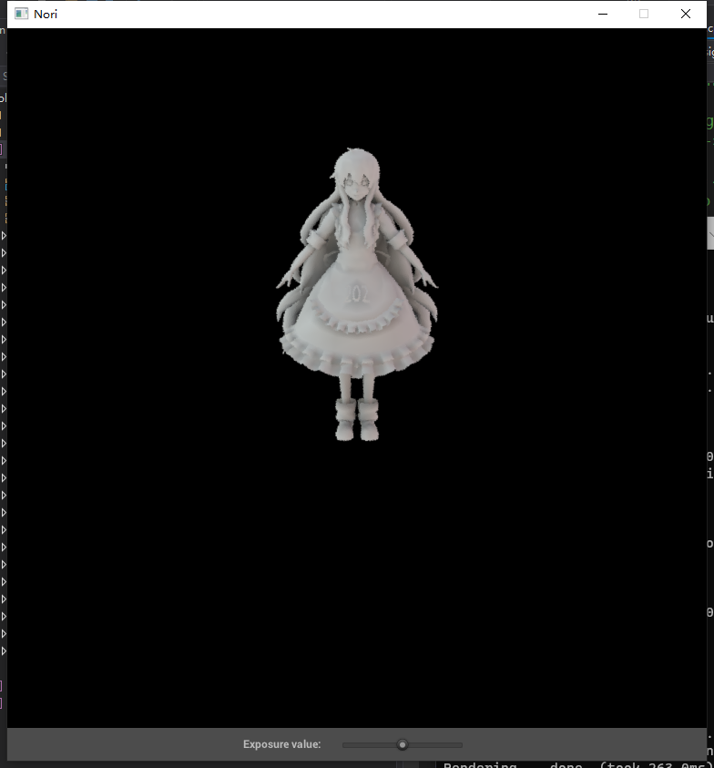
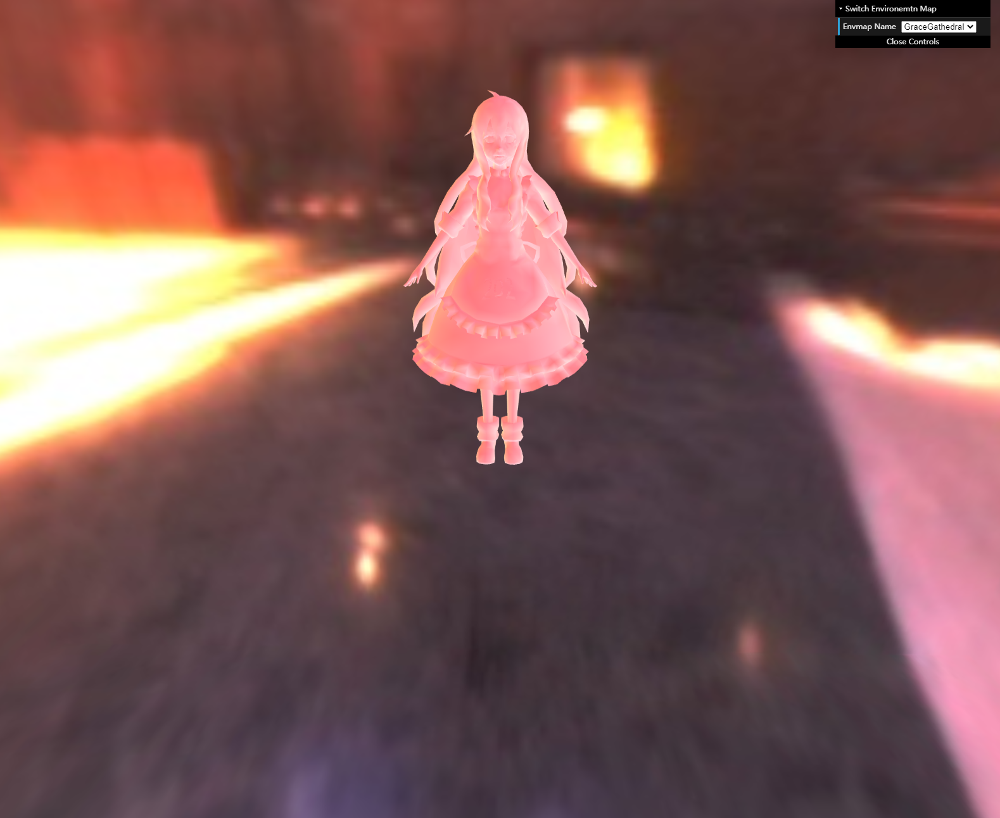

# GAMES202 homework2

## 完成
- 预计算环境光照
- 预计算 Diffuse Unshadowed LT
- 预计算 Diffuse Shadowed LT
- 预计算数据使用
- Bonus 1 : 预计算 Diffuse Inter-reflection
- Bonus 2 : SH 旋转

## 说明

### Bonus 1
- 实现为 prt.cpp中的Interreflection方法，递归调用
- 结果图在Indoor场景下，2 Bounce计算生成

### Bonus 2
- 实现在tool.js的前3个方法
- 将颜色的3个channel拆分分别处理的
- 结果图为默认时间，加速100倍

## Result

### Nori & Unshadowed

### Nori & Shadowed

### PRT & Unshadowed

### PRT & Shadowed

### PRT & Rotation

