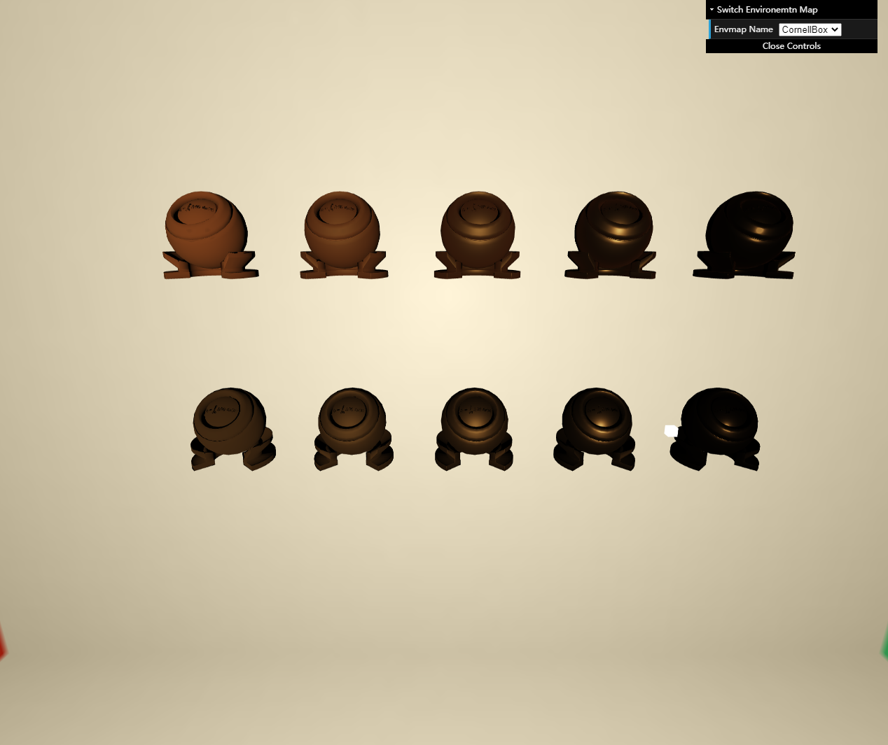

# GAMES202 homework4

## 完成
- 实现预计算E(µ)
- 实现预计算Eavg
- 实现PBR材质
- 实现Kulla-Conty材质
- Bonus 1 : 实现重要性采样的预计算方法
- Bonus 2 : 预计算E(µ)时，使用Split Sum完成预计算

## 说明

### Bonus 1
- GGX_Eavg_LUT.png为非Split Sum下生成
### Bonus 2
- Emu_IS.cpp IntegrateBRDF最终代码为Split Sum实现

## Result

### GGX_E_MC_LUT

### GGX_E_LUT

### GGX_Eavg_LUT

### Kulla-Conty

