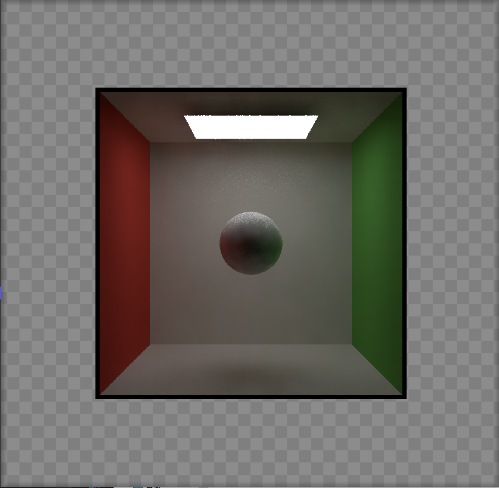
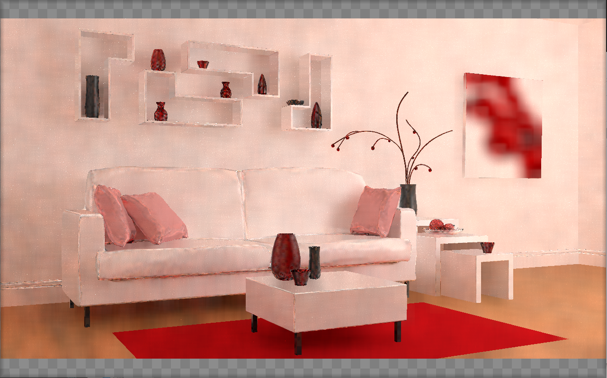

# GAMES202 homework5

## 完成
- 实现单帧降噪
- 实现两帧间的投影
- 实现两帧间的累积
- Bonus: 实现A-Trous Wavelet加速单帧降噪

## 说明
### Bonus1
- Denoiser::Filter函数中，使用5个pass实现A-Trous Wavelet
- denoiser.h中定义了2个m_sigmaColor，分别用于cornell box和pink room

## Result

